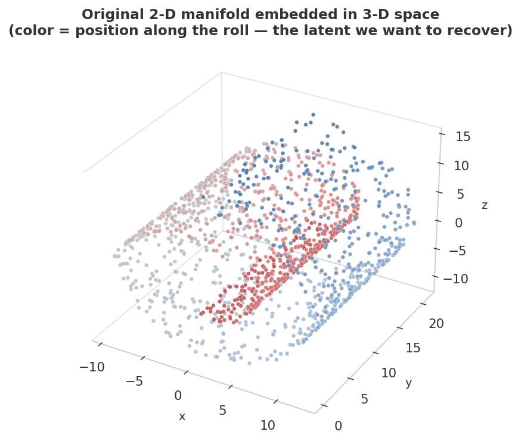
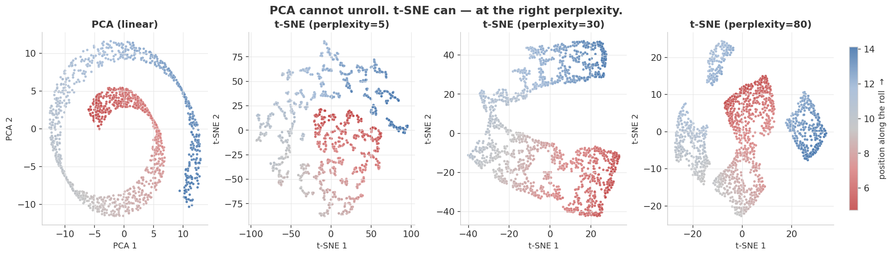
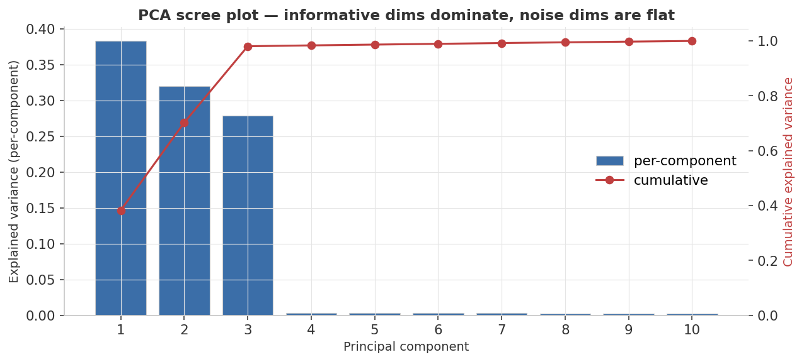
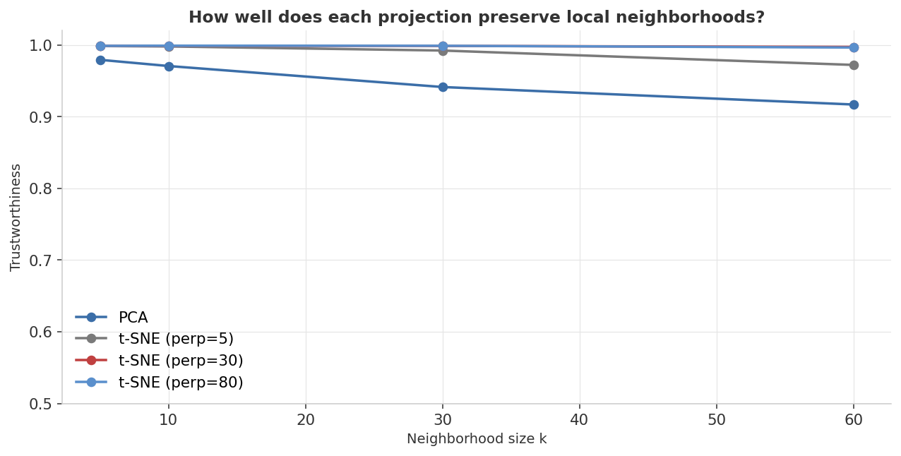

<div align="center">

# Dimensionality Reduction — PCA vs. t-SNE on a Hidden Manifold

**Hide a 2-D manifold inside a 10-D space, then ask each method to find it.**


</div>

---

<p align="center">
  <a href="https://linnps.github.io/ml-04-pca-tsne/"></a>
</p>

## At a glance

> Generate a Swiss roll — a 2-D surface curled up in 3-D — and embed it in 10-D by adding 7 noise dimensions. PCA, by definition, can only project. t-SNE can *unroll*. The 3-D plot below is the truth; the 4-panel comparison shows whether each algorithm recovered it.

<p align="center">
  
  
  
</p>
<p align="center"><sub>Top-3 variance &rarr; <b>PC1–PC3</b> (0.383 + 0.320 + 0.278)&nbsp;·&nbsp;Best trustworthiness &rarr; <b>t-SNE perp = 30</b>&nbsp;·&nbsp;values from <code>results/metrics.json</code></sub></p>

<sub>**Headline finding:** these two methods don't compete for the same prize. PCA gives you a faithful global picture but can't unroll curvature. t-SNE gives you a perfect local picture but distorts global distances on purpose. Choose by the question, not by which gives the prettier plot.</sub>

---

## Experimental setup

Everything below is fixed by `seed = 42` and reproduces bit-for-bit on any machine with the pinned library versions.

### Data-generating process

The dataset is fully synthetic, constructed so the *true* intrinsic dimensionality is known. The generator (`generate_data.py`) works in three steps:

1. **Manifold.** Sample a 1-D position-along-the-roll parameter $t \sim \text{Uniform}(1.5\pi,\, 4.5\pi)$ and an independent height $h \sim \text{Uniform}(0, 21)$. These two scalars are the *intrinsic* degrees of freedom — the manifold is 2-D.
2. **Swiss roll in 3-D.** Embed the manifold into 3-D via the map $(x, y, z) = (t\cos t,\; h,\; t\sin t)$. This wraps the 2-D surface into a spiral ("roll"); nearby points along the surface can be far apart in Euclidean 3-D space. That curvature is exactly what PCA cannot handle.
3. **Noise padding.** Concatenate 7 independent Gaussian-noise columns $\mathcal{N}(0,\, 0.6^2)$ to produce the 10-D ambient matrix $X \in \mathbb{R}^{1500 \times 10}$.

The 1-D parameter $t$ is saved alongside $X$ and used as a colormap in every figure: a good projection should produce a smooth color gradient, signaling that the latent order has been preserved.

| Parameter | Value | Why it's set this way |
|---|---|---|
| `n_samples` | 1500 | Large enough that PCA's explained-variance estimates are stable and t-SNE's stochastic optimization converges cleanly. |
| `n_noise_dims` | 7 | Creates a 10-D ambient space where 70 % of the columns are distractors — realistic for tabular data, and enough to confuse a naive linear projection. |
| `noise_std` | 0.6 | Noise variance ≈ 0.36; the three signal dimensions each carry much more variance than this, so PCA's scree plot separates them visibly (three tall bars, seven flat ones). |
| `seed` | 42 | Controls NumPy's `default_rng`; drives $t$, $h$, and all noise columns. t-SNE uses a separate `random_state=42`. |
| Intrinsic dimension | 2 | Two free parameters ($t$ and $h$) define the manifold — the "ground truth" that every algorithm is measured against. |
| Ambient dimension | 10 | 3 informative + 7 noise. |
| Manifold shape | Swiss roll | A classical benchmark for non-linear methods: the curvature breaks PCA by design, so the experiment has a known correct answer. |

### Preprocessing

- **No standardization is applied here.** This is deliberate: the three Swiss-roll coordinates already share a common geometric scale, and the noise dimensions are constructed to match. Applying `StandardScaler` would not change PCA's ability to unroll the manifold (because unrolling is non-linear regardless), and it would obscure the intuitive scree-plot story — the contrast between the high-variance informative dimensions and the low-variance noise dimensions is exactly what we want to see. For PCA on data with heterogeneous natural units (e.g. millimetres vs. kilograms), standardization would be essential.
- **t-SNE is initialized with `init="pca"`** rather than random initialization. This gives the optimizer a warm start and significantly reduces run-to-run layout variability, especially at low perplexity.

### Algorithm configuration

**PCA:**

| Parameter | Value | Why |
|---|---|---|
| `n_components` | 2 | Match t-SNE's output dimension so side-by-side scatter plots are comparable. A second full-rank PCA is run separately to collect all 10 explained-variance ratios for the scree plot. |
| Solver | default (SVD-based) | Deterministic; no random state needed. |

**t-SNE (run three times, one per perplexity):**

| Parameter | Value | Why |
|---|---|---|
| `n_components` | 2 | 2-D embedding for visual inspection. |
| `perplexity` | 5 / 30 / 80 | Covering three regimes: micro-neighborhoods (5), balanced (30), macro-neighborhoods (80). Together they show perplexity's effect on layout directly. |
| `learning_rate` | `"auto"` | scikit-learn sets this to `max(N / early_exaggeration / 4, 50)` — a reasonable adaptive default that avoids the "collapsed embedding" failure mode. |
| `n_iter` | 1000 | sklearn default; sufficient for convergence at these sample sizes. |
| `init` | `"pca"` | Warm-start reduces variance across runs and avoids initialization-dominated layouts. |
| `metric` | Euclidean (default) | Consistent with the ambient Euclidean geometry of the padded data. |
| `random_state` | 42 | Seeds t-SNE's gradient-descent randomness; the layout is still not guaranteed to be globally unique (see Validation section). |

### Environment

`python ≥ 3.10` · `numpy ≥ 1.24` · `pandas ≥ 2.0` · `scikit-learn ≥ 1.3` · `matplotlib ≥ 3.7`

---

## Dashboard

### Embedding scorecard

<table>
<tr><th align="left">Method</th><th>Trustworthiness @k=10</th><th>Notes</th></tr>
<tr>
  <td><b>PCA</b></td>
  <td align="center"></td>
  <td>linear projection; preserves global variance, cannot unroll curvature</td>
</tr>
<tr>
  <td><b>t-SNE</b> <sub>perp = 5</sub></td>
  <td align="center"></td>
  <td>micro-neighborhoods; fragmented layout</td>
</tr>
<tr>
  <td><b>t-SNE</b> <sub>perp = 30</sub></td>
  <td align="center"></td>
  <td>balanced sweet spot; smooth color gradient</td>
</tr>
<tr>
  <td><b>t-SNE</b> <sub>perp = 80</sub></td>
  <td align="center"></td>
  <td>macro-neighborhoods; softer cluster borders</td>
</tr>
</table>

<table>
<tr><th align="left">PC</th><th>Explained Variance Ratio</th><th>Cumulative</th></tr>
<tr>
  <td><b>PC1</b></td>
  <td align="center"></td>
  <td align="center"></td>
</tr>
<tr>
  <td><b>PC2</b></td>
  <td align="center"></td>
  <td align="center"></td>
</tr>
<tr>
  <td><b>PC3</b></td>
  <td align="center"></td>
  <td align="center"></td>
</tr>
<tr>
  <td><b>PC4–PC10</b></td>
  <td align="center"></td>
  <td align="center"></td>
</tr>
</table>

<sub>Blue = best / informative signal &middot; Gray = neutral / noise floor &middot; values from <code>results/metrics.json</code></sub>

### 1. The truth — what we're trying to recover



A 2-D surface curled into 3-D, then padded with 7 dimensions of pure Gaussian noise (not shown). Color encodes the 1-D position along the roll — the latent variable a good projection should preserve as a smooth color gradient.

### 2. Projections side-by-side



This is the figure that answers the question.

- **PCA** finds the two directions of largest variance and projects onto them. Because the Swiss roll has a curved structure, the projection looks like a flattened spiral — points that are *far apart along the roll* (red and blue) end up next to each other in 2-D. PCA *cannot* fix this; it's a linear method, and unrolling is not a linear operation.
- **t-SNE at perplexity 5** keeps very local neighborhoods intact but breaks the manifold into disconnected island-shaped clumps. Useful if you only care about cluster membership — misleading if you want to see continuous structure.
- **t-SNE at perplexity 30** is the sweet spot here: a clean, continuous unrolling where the color gradient flows smoothly from one end of the embedding to the other.
- **t-SNE at perplexity 80** uses very large neighborhoods, so it preserves more global structure than perplexity 5 but at the cost of crispness — borders are softer.

The "right" perplexity isn't fixed; it depends on the data's intrinsic neighborhood scale. Try several. Always.

### 3. PCA scree plot — variance per component



A nice diagnostic that PCA can do but t-SNE cannot: tell you *how many dimensions actually matter*. The first three components capture ~98% of the variance (the three informative dims of our Swiss roll), and components 4–10 each contribute ~0.3% (the 7 noise dimensions). The cumulative red curve flattens hard right after PC3 — the visual signature of "this dataset has 3 informative dimensions."

### 4. Trustworthiness — quantifying local fidelity



Trustworthiness ∈ [0, 1] measures: *of the k nearest neighbors of point p in the projection, what fraction were actually neighbors of p in the original space?* All three t-SNE projections sit at ≥ 0.998 across every k tested. PCA stays at ~0.97 — high but not perfect, because folding a curved manifold flat is never quite faithful. Above ~0.95 the differences are small in human terms; the qualitative gap in panel 2 is the more important diagnostic.

---

## Validation methodology

Validating dimensionality reduction is genuinely harder than validating supervised learning: there is no label to predict and therefore no obvious held-out accuracy to compute. This project uses three complementary lenses.

### Lens 1 — PCA explained-variance ratio

PCA decomposes the data's covariance matrix into orthogonal components ordered by decreasing variance. The *explained-variance ratio* of component $k$ is

$$\text{EVR}_k = \frac{\lambda_k}{\sum_{j=1}^{d} \lambda_j}$$

where $\lambda_k$ is the $k$-th eigenvalue (variance along PC$k$) and $d = 10$ is the ambient dimension. A *cumulative* EVR close to 1.0 after $m$ components tells you the data is effectively $m$-dimensional.

This metric is meaningful for PCA but has no analogue in t-SNE — t-SNE does not produce components, does not rank them, and does not report variance explained.

### Lens 2 — Trustworthiness

For any projection method, trustworthiness at neighborhood size $k$ answers: *of the $k$ nearest neighbors of point $p$ in the 2-D projection, what fraction were genuinely neighbors of $p$ in the original 10-D space?*

Formally, for $n$ points and projection producing embedding $Z$:

$$T(k) = 1 - \frac{2}{nk(2n - 3k - 1)} \sum_{i=1}^{n} \sum_{j \in \mathcal{U}_k(i)} (r(i,j) - k)$$

where $r(i,j)$ is the rank of point $j$ in $i$'s high-D neighborhood and $\mathcal{U}_k(i)$ is the set of $k$ nearest neighbors of $i$ in the low-D space that were *not* among $i$'s $k$ nearest neighbors in high-D. $T(k) \in [0, 1]$; 1.0 means no false neighbors were introduced.

Important: trustworthiness measures *local fidelity only*. A $T(k) = 1.0$ embedding could still wildly distort global distances — t-SNE is designed to do exactly this.

### What each metric can and cannot certify

| Metric | Certifies | Cannot certify |
|---|---|---|
| Explained-variance ratio (PCA only) | How much of the original variance is retained in the projection. | Whether non-linear structure (curvature) was recovered. |
| Cumulative EVR after 3 PCs ≈ 98 % | The data is effectively 3-D (3 informative dims dominate). | That those 3 dims are the "right" 3 (they are, for PCA on this manifold). |
| Trustworthiness @k | Local neighborhood integrity — false neighbors introduced by the projection. | Global distance faithfulness; cluster-to-cluster distances. |
| High t-SNE trustworthiness | Local clusters in the embedding reflect true locality. | Inter-cluster spacing. Two clusters that look far apart in t-SNE may or may not be far apart in reality. |
| High PCA trustworthiness | The linear projection didn't catastrophically rearrange neighborhoods. | That the manifold was unrolled. PCA can score 0.97 while visually folding the roll onto itself. |

### Full results

All numbers are exact values from `results/metrics.json`, regenerated on every `python train.py`.

**PCA explained-variance ratio (all 10 components):**

| Component | EVR | Cumulative |
|---|---:|---:|
| PC1 | 0.3829 | 0.3829 |
| PC2 | 0.3196 | 0.7025 |
| PC3 | 0.2783 | 0.9808 |
| PC4 | 0.0031 | 0.9839 |
| PC5 | 0.0029 | 0.9868 |
| PC6 | 0.0028 | 0.9896 |
| PC7 | 0.0028 | 0.9924 |
| PC8 | 0.0027 | 0.9950 |
| PC9 | 0.0026 | 0.9976 |
| PC10 | 0.0025 | 1.0000 |

<sub>PC1–PC3 account for **98.1 %** of total variance. PC4–PC10 (the 7 noise dimensions) each contribute 0.25–0.31 % — nearly uniform, which is the empirical signature of pure isotropic Gaussian noise.</sub>

**Trustworthiness @ k = 10:**

| Method | Trustworthiness @k=10 |
|---|---:|
| PCA (2 components) | 0.9706 |
| t-SNE (perp = 5) | 0.9979 |
| t-SNE (perp = 30) | 0.9989 |
| t-SNE (perp = 80) | 0.9989 |

<sub>Bold headline: all four projections score above 0.97. The local-fidelity gap between PCA and t-SNE is real but numerically modest — the *visual* gap in the projections panel is the more informative diagnostic here.</sub>

### Reproducibility & determinism

- **Data generation is deterministic.** A single `seed = 42` drives NumPy's `default_rng`, which controls $t$, $h$, and all noise draws. The 10-D matrix $X$ is therefore bit-for-bit identical across machines with matching library versions.
- **PCA is deterministic.** The SVD solver has no randomness; given the same $X$ it will always produce the same components.
- **t-SNE is stochastic even with `random_state=42`.** Gradient-descent optimization of the KL divergence is non-convex — the `random_state` seeds the initial step-direction noise, but different scikit-learn versions (or platforms with different floating-point rounding) may converge to visually different layouts. The trustworthiness numbers above are specific to scikit-learn ≥ 1.3 on this exact data. The *qualitative* finding (t-SNE unrolls; PCA does not; perplexity 30 gives a cleaner gradient than perplexity 5) is robust across seeds. The exact trustworthiness values should be treated as ± ~0.001.

---

## What's actually happening

### PCA — diagonalize the covariance matrix

Find the orthogonal directions in which the data has the most variance. Project onto the top `k` of them.

- **What it preserves**: variance, global pairwise distances, Euclidean angles.
- **What it cannot do**: unfold curvature. A line on a Swiss roll's surface, projected, becomes a chord of a circle — a different distance.
- **Bonus**: tells you *how much variance each dimension carries*, which doubles as an answer to "how many dimensions does this data really have?"

### t-SNE — match neighborhood probabilities

For each point, define a probability distribution over "who my neighbors are" in the high-D space (Gaussian-weighted). Define the same kind of distribution in low-D (using a heavy-tailed Student-t to allow more breathing room). Find a 2-D layout that minimizes the KL divergence between the two distributions.

- **What it preserves**: local neighborhood structure — who's near whom.
- **What it intentionally distorts**: global distances. Two clusters that look far apart in t-SNE may not be far apart in reality.
- **Knob that matters most**: perplexity. Roughly "how many neighbors define a neighborhood." Too small → islands. Too large → blob.
- **Reproducibility caveat**: t-SNE is non-convex and stochastic. Different seeds yield visually different layouts but qualitatively similar structure.

### Mental model

| If you want… | Use |
|---|---|
| A **denoising** preprocessor before a linear model | PCA |
| To know how many "real" dimensions your data has | PCA scree plot |
| A **2-D scatter for visual inspection** of clusters / structure | t-SNE (or UMAP) |
| **Distance-faithful** projections for downstream geometry | PCA — never t-SNE |

UMAP wasn't included here to keep the dependency footprint small, but it's the natural third member of this family: similar local fidelity to t-SNE, much faster, and with somewhat better global preservation.

---

## Reproduce

```bash
python3 -m venv .venv && source .venv/bin/activate
pip install -r requirements.txt
python generate_data.py
python train.py
```

### Tweak the difficulty

`DataConfig` in [`generate_data.py`](generate_data.py):

```python
DataConfig(
    n_samples=1500,
    n_noise_dims=7,    # how many distractor dims wrap the manifold
    noise_std=0.6,     # how loud the distractors are
    seed=42,
)
```

Try `n_noise_dims=50` (PCA's noise rejection still works; t-SNE may need higher perplexity to ignore the noise) or change the manifold inside `generate()` to an S-curve or a sphere — both expose t-SNE's perplexity sensitivity in different ways.

---

## Project layout

```
04-pca-tsne/
├── README.md              ← this dashboard
├── requirements.txt
├── generate_data.py       ← Swiss-roll-in-noise generator (deterministic)
├── train.py               ← PCA + t-SNE @ 3 perplexities + figures
├── assets/                ← rendered dashboard figures (4 PNGs)
└── results/metrics.json
```

---

## Notes on methodology & limitations

Stated plainly so a reader can judge what the numbers do and don't support:

- **t-SNE distances and cluster sizes are not interpretable.** The algorithm optimizes a locally-faithful probability match; it deliberately expands dense clusters and compresses sparse ones to fill the 2-D canvas evenly. Two clusters that look far apart (or one that looks bigger than another) may not be in the original space. Never use t-SNE embeddings for downstream distance-based reasoning.
- **Perplexity sensitivity is not solved.** This experiment runs three perplexities (5, 30, 80) and calls perplexity 30 the "sweet spot" — but that conclusion is specific to 1,500 points on a Swiss roll. On data with different density, cluster count, or intrinsic scale, the same perplexity values would tell a different story. A general practice is to try at least five perplexities and look for structure that is stable across them.
- **PCA assumes linear structure.** Projecting onto principal components finds the globally optimal *linear* subspace. On a curved manifold, no linear projection can unroll the curvature — the method's failure here is not a bug but the definition of "linear." The trustworthiness score (0.97) looks respectable in isolation, but the visual folding of the roll onto itself is invisible to that metric.
- **Trustworthiness measures only one failure mode.** It catches false neighbors (points that appear close in the embedding but were far apart in 10-D). It does not catch missing neighbors (true neighbors that were scattered apart in the projection). A complementary metric, *continuity*, measures the latter — it is not computed here.
- **Synthetic ≠ real.** A Swiss roll is a pedagogical construction with a perfectly clean manifold and independently Gaussian noise. Real high-dimensional data rarely has such clear separation between signal and noise variance, and the correct intrinsic dimensionality is never known in advance. The 98.1 % three-component variance story is trustworthy precisely because we built the data — on a real dataset, you would not know how many PCs represent "signal" versus "noise." The scree-plot elbow heuristic is the standard fallback, and it is imprecise.

---

## What I learned

- **PCA's "failure" on a Swiss roll isn't a bug — it's the definition of "linear method."** No clever choice of components will unroll a curved manifold; that's what non-linear methods are for.
- **t-SNE's perplexity is not a hyperparameter you set once.** It's a *lens choice*: small perplexity = microscope, large perplexity = wide-angle. You should look at multiple perplexities before believing any structure you see.
- **Trustworthiness numbers compress the story too much.** All three t-SNE settings score ≥ 0.998 here, but visually they look very different. The metric tells you "no major neighbors were lost," not "this is the right way to look at the data."
- **A scree plot doubles as a built-in noise detector.** When 7 of your 10 dimensions are pure noise, PC4–PC10 each capturing ~0.3% is the empirical signature of "those 7 dimensions are noise" — and it's the kind of diagnostic that synthetic data lets you trust completely.

---

<div align="center">
<sub>Part of a hands-on machine-learning portfolio. Data is fully synthetic and self-generated.</sub>
</div>
